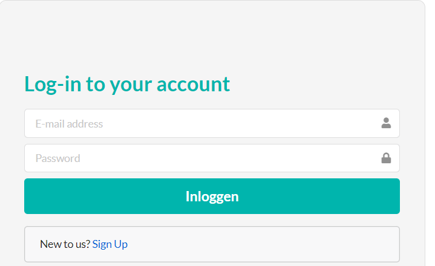

# Projectvoorstel Programming innovation

# Naam :

VisWinkel

# Beschrijving :

Deze Project gaat over viswinkel en kan gebruikt worden door kleinhandel of groothandel .

## In Start Page:

- Een gebruiker logt in met volgende gegevens:
  - E-mail
  - paswoord

_Hier wordt Alle informatie gevalideerd_

- Een gebruiker moet zich registeren

## In Registern Page:

**Een gebruiker moet zich registeren met volgende gegevens:**

- Username
- E-mail
- Paswoord
- Geboortedatum
- Akkoord met de algemene voorwaarden van de applicatie

_Hier wordt Alle informatie gevalideerd_

## Na Succesfull inloggen:

### 1. Home Page

Komt algemene informatie over vis producten en staat navigation in de header van page.

#### De gebruiker kan:

- Producten sorteren(volgens prijs of Category en zover ......)
- Prodcuten zoeken(text......)
- Navigeren tussen pages

_In de foto staat overzicht hoe mijn project zal zijn_

2. ### Kwaliteit Page :

Komt algemene informatie over Kwaliteit van vis.

### 3. Producten Page

Alle producten of gesorteerd producten(Het hangt van af wat de gebruiker geklikt heeft )
In Deze page komt list van met Naam van Product and prijs .

#### De gebruiker kan:

- Alle informatie over product zien wanneer hij/zij knop details kilkt

- De producten Toevoegen Of Wijzegen met volgende gegevens :

  - Naam van product
  - _Category_
  - _Prijs_
  - _Afkomstig_
  - _Verwerking_
  - _Aankomstig datum_
  - _Beschrijving_
  - _......_

_Hier wordt Alle informatie gevalideerd_

- de producten verwijderen .
- De producten aan winkelmandje toevoegen.

### 4.Een spelletje

Hier kan de gebruiker spelen met vragen over de vissen en hij/zij kan kennisheid uitbreiden over de vis

### 5. Bestellen Page:

In deze page komt alle producten wat de gebruiker bestelt heeft

#### De gebruiker kan:

- Producten verwijderen van winkelmandje
- Aantal producten aanpassen
- De betalen van producten kan niet behandel worden

  

💡 Ter informatie :

- **Informatie** die in deze voorstel kan nog uitgebreid worden . Het hangt ervan af mijn capaciteiten en wat ik ga leren in deze moudel maar ik zal altijd met mijn lector bespreken 
- **Foto's** die in deze voorstel staat, komt van websites die op internet staat om mijn idee onder te steunen en zeker mijn project zal anders zijn
